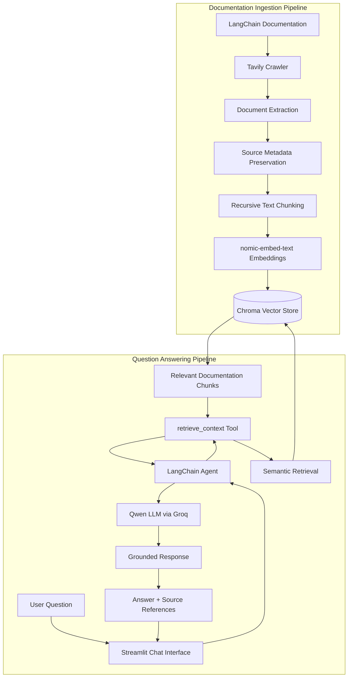

# AI Documentation Assistant

An end-to-end AI-powered documentation assistant that automatically crawls technical documentation, builds a semantic knowledge base, and answers user questions using agent-driven retrieval with source attribution.

The application combines automated web crawling, recursive document chunking, local embedding generation, asynchronous vector indexing, semantic retrieval, LLM tool calling, and an interactive Streamlit chat interface.

The current implementation uses LangChain documentation as its knowledge source, while the architecture can be adapted to other technical documentation websites.

---

## Demo

<!-- Add your demo GIF to assets/demo.gif -->


The application allows users to ask technical questions about indexed documentation and receive context-grounded answers together with the source pages used during retrieval.

---

## Problem Statement

Technical documentation is often distributed across many pages and sections. Finding the correct information for a specific development question can require manually searching through multiple documentation pages.

Large Language Models can provide quick answers, but relying entirely on their pretrained knowledge introduces several challenges:

* information may be outdated;
* responses may not reflect the latest documentation;
* answers may contain unsupported information;
* users cannot easily verify where an answer came from.

This project addresses these limitations by building a Retrieval-Augmented Generation workflow around technical documentation.

Instead of answering directly from the model's internal knowledge, the system retrieves relevant documentation chunks and provides them to the LLM as context before generating the final response.

---

## Architecture



The system is divided into two major workflows:

1. **Documentation Ingestion Pipeline** — converts documentation websites into a searchable semantic knowledge base.
2. **Question Answering Pipeline** — retrieves relevant documentation and uses it to generate source-grounded responses.

---

## How the System Works

### 1. Documentation Crawling

The ingestion pipeline uses Tavily Crawl to explore the target documentation website and extract content from discovered pages.

Each crawled page is converted into a LangChain `Document` containing:

* extracted page content;
* original page URL stored as `source` metadata.

Preserving source metadata during ingestion allows retrieved content to be traced back to its original documentation page.

---

### 2. Document Chunking

The extracted documents are processed using `RecursiveCharacterTextSplitter`.

Current configuration:

| Parameter     | Value |
| ------------- | ----: |
| Chunk Size    |  1000 |
| Chunk Overlap |   200 |

The overlap helps preserve contextual continuity between neighboring chunks while keeping individual retrieval units manageable for semantic search.

---

### 3. Local Embedding Generation

Document chunks are converted into dense vector representations using:

`nomic-embed-text`

The embedding model runs locally through Ollama.

This separates embedding generation from hosted LLM inference and allows the knowledge-base creation process to run without relying on a paid embedding API.

---

### 4. Asynchronous Vector Indexing

The ingestion pipeline divides document chunks into configurable batches and indexes them asynchronously.

The pipeline uses Python `asyncio` to process multiple indexing batches concurrently.

The ingestion flow is:

```text
Documentation Website
        ↓
Tavily Crawl
        ↓
LangChain Documents
        ↓
Recursive Chunking
        ↓
Local Embeddings
        ↓
Asynchronous Batch Indexing
        ↓
Chroma Vector Store
```

The pipeline also logs:

* number of crawled documents;
* number of generated chunks;
* batch indexing progress;
* successful and failed batches;
* final ingestion summary.

---

### 5. Persistent Vector Storage

Generated embeddings and document metadata are stored in a persistent Chroma vector database.

The same persisted Chroma collection is used by both:

* the ingestion pipeline for document indexing;
* the backend retrieval pipeline for semantic search.

This ensures that the documents indexed during ingestion are available to the question-answering application.

---

### 6. Agent-Driven Retrieval

Semantic retrieval is exposed to the LLM as a LangChain tool:

`retrieve_context`

When the user asks a question, the agent uses the retrieval tool to search the Chroma knowledge base for relevant documentation chunks.

The retrieval tool returns two outputs:

1. **Serialized content** for the LLM.
2. **Raw Document artifacts** for the application.

This design separates model-facing context from application-facing metadata.

---

### 7. Tool Artifacts and Source Attribution

The retrieval tool uses LangChain's `content_and_artifact` response format.

The LLM receives serialized documentation content for answer generation, while the application preserves the original retrieved `Document` objects.

After agent execution, the backend:

1. inspects tool messages;
2. extracts document artifacts;
3. reads the `source` metadata;
4. returns the source URLs with the generated answer.

The frontend then displays the unique source pages in an expandable **Sources** section.

---

### 8. Response Generation

The agent uses the retrieved documentation context to generate the final response.

The current implementation uses a Qwen model through Groq for hosted LLM inference.

The system prompt instructs the agent to:

* retrieve relevant documentation before answering;
* use retrieved documentation as supporting context;
* avoid claiming unsupported information;
* cite relevant sources;
* acknowledge when sufficient information cannot be found.

---

### 9. Streamlit Chat Interface

The application provides an interactive Streamlit frontend.

The interface supports:

* conversational question input;
* assistant response rendering;
* retrieval and generation loading state;
* source URL display;
* session-based message history;
* chat clearing from the sidebar.

The frontend communicates with the backend through the `run_llm()` function, which returns:

```text
{
    answer: generated response,
    context: retrieved documents
}
```

The frontend formats the retrieved document metadata into unique source URLs for display.

---

## Key Features

* Automated technical documentation crawling
* Source metadata preservation
* Recursive text chunking
* Local embedding generation
* Persistent Chroma vector storage
* Semantic similarity retrieval
* Asynchronous batch indexing
* Agent-driven retrieval
* LLM tool calling
* Tool artifact extraction
* Source attribution
* Hosted LLM inference
* Interactive Streamlit chat interface
* Session-based conversation display
* Modular separation of ingestion, backend logic, and frontend presentation

---

## Technology Stack

| Component              | Technology               |
| ---------------------- | ------------------------ |
| Programming Language   | Python                   |
| LLM Orchestration      | LangChain                |
| Chat Model             | Qwen                     |
| LLM Inference          | Groq                     |
| Embedding Model        | nomic-embed-text         |
| Embedding Runtime      | Ollama                   |
| Documentation Crawling | Tavily                   |
| Vector Database        | Chroma                   |
| Text Processing        | LangChain Text Splitters |
| Frontend               | Streamlit                |
| Concurrent Processing  | Python asyncio           |
| Environment Management | uv                       |

---

## Project Structure

```text
AI-Documentation-Assistant/
│
├── doc_helper_backend/
│   ├── __init__.py
│   └── core.py
│
├── dochelper_ingestion.py
├── main.py
├── logger.py
│
├── chroma_db/
│
├── assets/
│   ├── architecture.png
│   └── demo.gif
│
├── .env.example
├── .gitignore
├── .python-version
├── pyproject.toml
├── uv.lock
└── README.md
```

### Main Components

#### `dochelper_ingestion.py`

Responsible for:

* documentation crawling;
* content extraction;
* LangChain document creation;
* source metadata preservation;
* recursive text chunking;
* local embedding generation;
* asynchronous batch indexing;
* Chroma vector storage.

#### `doc_helper_backend/core.py`

Responsible for:

* loading the embedding model;
* connecting to the persisted Chroma database;
* creating the semantic retriever;
* defining the retrieval tool;
* initializing the LLM agent;
* invoking the agent;
* extracting generated answers;
* extracting retrieved document artifacts.

#### `main.py`

Responsible for:

* Streamlit application configuration;
* user question input;
* session-state management;
* chat rendering;
* backend invocation;
* answer display;
* source URL formatting and display.

#### `logger.py`

Provides structured console logging for:

* pipeline stages;
* ingestion progress;
* indexing status;
* warnings;
* errors;
* successful completion.

---

## Getting Started

### Prerequisites

Before running the application, install:

* Python 3.11 or later
* uv
* Ollama

The application also requires API credentials for:

* Groq
* Tavily

---

## Installation

### 1. Clone the Repository

```bash
git clone https://github.com/Brenjoel/AI-Documentation-Assistant.git
cd AI-Documentation-Assistant
```

### 2. Install Dependencies

```bash
uv sync
```

### 3. Download the Embedding Model

```bash
ollama pull nomic-embed-text
```

### 4. Configure Environment Variables

Create a `.env` file in the project root.

```env
GROQ_API_KEY=your_groq_api_key
TAVILY_API_KEY=your_tavily_api_key
```

Do not commit real API credentials to version control.

---

## Running the Application

The application has two separate execution stages.

### Step 1: Build the Knowledge Base

Run the ingestion pipeline:

```bash
uv run python dochelper_ingestion.py
```

The pipeline will:

1. crawl the configured documentation website;
2. extract page content;
3. preserve source URLs;
4. split documents into chunks;
5. generate embeddings locally;
6. asynchronously index chunks into Chroma.

After successful ingestion, the persisted Chroma database will be available to the retrieval pipeline.

### Step 2: Start the Chat Application

```bash
uv run streamlit run main.py
```

The Streamlit application will start locally and provide a browser address.

---

## Example Questions

After indexing the LangChain documentation, example questions include:

* What are Deep Agents?
* How does `create_agent` work in LangChain?
* How are tools provided to an agent?
* What is middleware in LangChain agents?
* How does LangChain support retrieval?
* What is the difference between an agent and a chain?
* How can tools be used during agent execution?

The quality of the answer depends on whether the relevant documentation pages were included during crawling and successfully indexed.

---

## Design Decisions

### Why Retrieval-Augmented Generation?

LLMs rely on knowledge learned during training and may provide outdated or unsupported answers.

Retrieval-Augmented Generation introduces an external knowledge source at query time.

In this application, relevant technical documentation is retrieved and supplied to the model before answer generation.

This provides:

* access to external documentation;
* improved answer grounding;
* traceability through source metadata;
* easier knowledge-base updates without model retraining.

---

### Why Agent-Driven Retrieval?

A traditional RAG chain usually follows a fixed sequence:

```text
Question
    ↓
Retrieve
    ↓
Generate
    ↓
Answer
```

This project exposes retrieval as an LLM tool.

The architecture becomes:

```text
Question
    ↓
Agent
    ↓
Retrieval Tool
    ↓
Chroma
    ↓
Relevant Context
    ↓
Agent
    ↓
Answer
```

This design makes the retrieval capability part of the agent's tool interface and provides a foundation for introducing additional tools later.

---

### Why Chroma?

Chroma provides a simple persistent vector-store architecture suitable for local development and portfolio applications.

It allows the project to:

* persist indexed documents locally;
* perform semantic similarity retrieval;
* store document metadata;
* reload the same knowledge base during application startup;
* experiment without requiring a managed vector database service.

---

### Why Local Embeddings?

The project uses `nomic-embed-text` through Ollama for embedding generation.

This allows embedding generation to run locally while LLM inference remains hosted separately.

The architecture therefore separates:

```text
Embedding Generation → Local Ollama Runtime

Response Generation → Hosted Groq Inference
```

This makes the system useful for experimenting with hybrid local and hosted AI infrastructure.

---

### Why Tool Artifacts?

The model needs document text to generate an answer, while the frontend needs original document metadata to display sources.

The retrieval tool therefore returns:

```text
content  → consumed by the LLM

artifact → consumed by application code
```

This prevents the frontend from depending on the LLM to reproduce source URLs correctly.

---

### Why Asynchronous Indexing?

Documentation crawling can produce many chunks.

Sequentially inserting every batch can increase ingestion time.

The project uses asynchronous batch processing to organize indexing work concurrently and independently track the success or failure of each batch.

---

## What I Learned

This project was developed to understand the complete lifecycle of an LLM application rather than only the final model invocation.

Key learning areas included:

* converting a documentation website into an AI knowledge base;
* crawling and processing web content;
* preserving metadata through an ingestion pipeline;
* understanding chunk size and overlap;
* generating embeddings locally;
* persisting and retrieving vectors with Chroma;
* asynchronous Python execution with `asyncio`;
* batching document indexing workloads;
* exposing retrieval as an LLM tool;
* understanding LangChain tool-call execution;
* using `ToolMessage` artifacts;
* separating model context from application metadata;
* displaying retrieval sources in a frontend;
* integrating ingestion, retrieval, generation, and UI layers into one application.

---

## Current Limitations

The current implementation is a portfolio-oriented application and has several areas for future improvement:

* the documentation URL is configured directly in the ingestion code;
* ingestion currently performs a complete crawl rather than incremental synchronization;
* duplicate-content detection is not yet implemented;
* retrieval quality has not yet been evaluated against a benchmark dataset;
* the application currently uses dense semantic retrieval without hybrid search;
* retrieved chunks are not reranked before generation;
* session messages are displayed in the UI but are not yet used as persistent conversational memory;
* automated test coverage is limited;
* the application has not yet been containerized or deployed.

---

## Future Improvements

Planned enhancements include:

* configurable documentation sources;
* incremental documentation synchronization;
* content hashing and duplicate detection;
* metadata filtering;
* query rewriting;
* conversational retrieval;
* hybrid sparse and dense search;
* retrieval reranking;
* automated RAG evaluation;
* retrieval precision measurement;
* groundedness evaluation;
* response streaming;
* persistent conversation memory;
* automated tests;
* Docker containerization;
* FastAPI backend separation;
* CI/CD pipeline;
* cloud deployment.

---

## Learning Progression

This project represents a progression from basic LLM interaction toward complete AI application engineering.

```text
LLM Invocation
      ↓
Prompt Composition
      ↓
Embeddings
      ↓
Vector Search
      ↓
Basic RAG
      ↓
Tool Calling
      ↓
Agent-Driven Retrieval
      ↓
Asynchronous Ingestion
      ↓
Source Attribution
      ↓
End-to-End AI Application
```

The next stage of development focuses on evaluation, automated testing, deployment, and production-oriented reliability.

---

## Repository

The source code is available in the AI Documentation Assistant repository.

---

## Author

**Sikha Brenjoel**

Focused on AI engineering, Generative AI applications, Retrieval-Augmented Generation, LLM agents, LangGraph workflows, vector databases, and cloud ML engineering.

---

## License

This project is currently intended for educational and portfolio purposes.

An open-source license can be added if the project is opened for external use or contribution.
